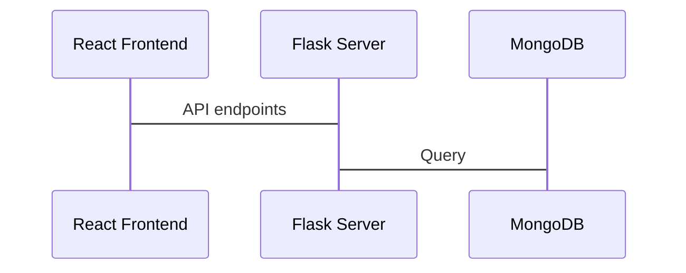

# VirtualSpice Server

This folder contains the files responsible for backend service.

## UML diagram 'SPIKE'

## TODO

|                |DONE|
|----------------|-------------------------------|
|Write basic Flask API|`False`            |
|Define API routes|`False`              |
|Initialize MongoDB|`False`   |
|Create connections between Server and DB|`False`   |

